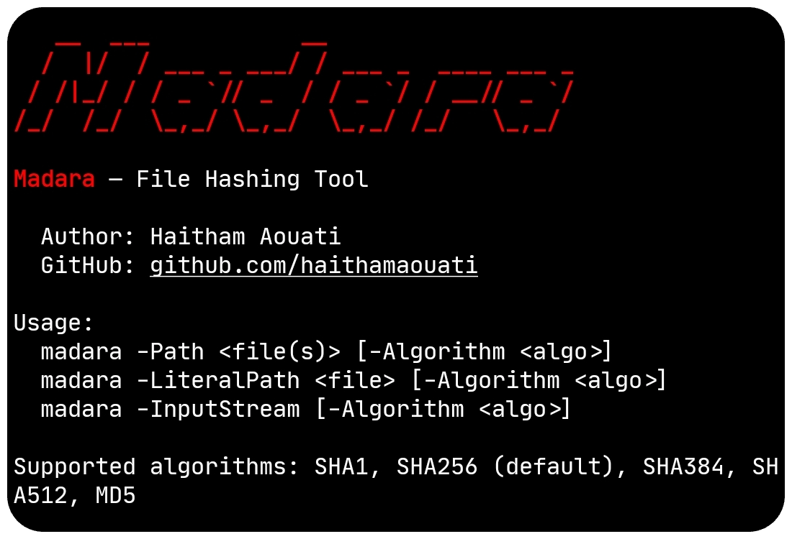

# Madara
**Madara** — File Hashing Tool

Madara replicates PowerShell’s [Get-FileHash](https://learn.microsoft.com/en-us/powershell/module/microsoft.powershell.utility/get-filehash?view=powershell-7.5) functionality using Bash scripting.

## Preview



## Install

To use the Madara script, follow these steps:

1. Clone the repository:

    ```
    git clone https://github.com/haithamaouati/Madara.git
    ```

2. Change to the Madara directory:

    ```
    cd Madara
    ```
    
3. Change the file modes
    ```
    chmod +x madara.sh
    ```
    
5. Run the script:

    ```
    ./madara.sh
    ```

## Usage

Usage: `./madara.sh -Path <file> -Algorithm <algo>`

##### Options:

`-Path` `<file(s)>` [-Algorithm <algo>]

`-LiteralPath` `<file>` [-Algorithm <algo>]

`-InputStream` [-Algorithm <algo>]

Supported algorithms: `SHA1`, `SHA256` (default), `SHA384`, `SHA512`, `MD5`

## Algorithm:

- SHA1
- SHA256
- SHA384
- SHA512
- MD5

> [!NOTE]
> If no value is specified, or if the parameter is omitted, the default value is SHA256.

## Environment
- Tested on [Termux](https://termux.dev/en/)

## Disclaimer
> [!WARNING]
> We are not responsible for any misuse or damage caused by this program. use this tool at your own risk!

## License

Madara is licensed under [WTFPL](LICENSE).
